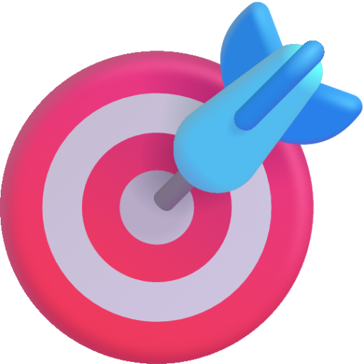

<a name="readme-top"></a>

<!-- PROJECT LOGO -->
<br />
<div align="center">
  <a href="https://github.com/GabrieleGigante/bullseye">
    
  </a>

<h3 align="center">Bullseye</h3>

  <p align="center">
    Bullseye is a Gin inspired web framework for Dart.
    <br />
    <a href="https://github.com/GabrieleGigante/bullseye/tree/main/docs"><strong>Explore the docs »</strong></a>
    <br />
    <br />
    <a href="https://github.com/GabrieleGigante/bullseye/tree/main/example">Examples</a>
    ·
    <a href="https://github.com/GabrieleGigante/bullseye/issues">Report Bug</a>
    ·
    <a href="https://github.com/GabrieleGigante/bullseye/issues">Request Feature</a>
  </p>
</div>


<!-- TABLE OF CONTENTS -->
<details>
  <summary>Table of Contents</summary>
  <ol>
    <li><a href="#getting-started">Getting Started</a></li>
    <li><a href="#usage">Usage</a></li>
    <li><a href="#contributing">Contributing</a></li>
    <!-- <li><a href="#acknowledgments">Acknowledgments</a></li> -->
    <li><a href="#contacts">Contacts</a></li>
  </ol>
</details>


<!-- ABOUT THE PROJECT -->
<!-- ## About The Project

[![Product Name Screen Shot][product-screenshot]](https://example.com) -->


<!-- GETTING STARTED -->
## Getting Started

Add the package to your dependencies:

```bash
dart pub add bullseye
```
<!-- or
```dart
dependencies:
  bullseye: latest
```
<br/> -->

Import the package:

```dart
import 'package:bullseye/bullseye.dart';
```

Create a new instance of Bullseye:

```dart
final app = Bullseye(port: 3000);
```

Create a new route:

```dart
app.get('/', (Context c) => c.json({'message': 'Hello World!'}));
```

Start the server:

```dart
app.listen();
```

<p align="right">(<a href="#readme-top">back to top</a>)</p>


<!-- USAGE EXAMPLES -->
## Usage

Usage examples can be found in the [example directory](https://github.com/GabrieleGigante/bullseye/tree/main/example).
To run in development mode:

```bash
dart run example/helloworld.dart
```
To run in production mode:

```bash
dart compile exe example/helloworld.dart
./example/helloworld.exe
```


<p align="right">(<a href="#readme-top">back to top</a>)</p>

<!-- ROADMAP -->
## Roadmap

######TODO
<!-- - [ ] Feature 1
- [ ] Feature 2
- [ ] Feature 3
    - [ ] Nested Feature -->

See the [open issues](https://github.com/GabrieleGigante/bullseye/issues) for a full list of proposed features (and known issues).

<p align="right">(<a href="#readme-top">back to top</a>)</p>


<!-- CONTRIBUTING -->
## Contributing

Contributions are what make the open source community such an amazing place to learn, inspire, and create. Any contributions you make are **greatly appreciated**.

If you have a suggestion that would make this better, please fork the repo and create a pull request. You can also simply open an issue with the tag "enhancement".
Don't forget to give the project a star! Thanks again!

1. Fork the Project
2. Create your Feature Branch (`git checkout -b feature/AmazingFeature`)
3. Commit your Changes (`git commit -m 'Add some AmazingFeature'`)
4. Push to the Branch (`git push origin feature/AmazingFeature`)
5. Open a Pull Request

<p align="right">(<a href="#readme-top">back to top</a>)</p>

<!-- CONTACTS -->
## Contacts

- [GabrieleGigante](mailto:gabriele@gigante.cc)

<p align="right">(<a href="#readme-top">back to top</a>)</p>


<!-- ACKNOWLEDGMENTS -->
<!-- ## Acknowledgments

* []()
* []()
* []()

<p align="right">(<a href="#readme-top">back to top</a>)</p> -->


<!-- MARKDOWN LINKS & IMAGES -->
<!-- https://www.markdownguide.org/basic-syntax/#reference-style-links -->
[contributors-shield]: https://img.shields.io/github/contributors/GabrieleGigante/bullseye.svg?style=for-the-badge
[contributors-url]: https://github.com/GabrieleGigante/bullseye/graphs/contributors
[forks-shield]: https://img.shields.io/github/forks/GabrieleGigante/bullseye.svg?style=for-the-badge
[forks-url]: https://github.com/GabrieleGigante/bullseye/network/members
[stars-shield]: https://img.shields.io/github/stars/GabrieleGigante/bullseye.svg?style=for-the-badge
[stars-url]: https://github.com/GabrieleGigante/bullseye/stargazers
[issues-shield]: https://img.shields.io/github/issues/GabrieleGigante/bullseye.svg?style=for-the-badge
[issues-url]: https://github.com/GabrieleGigante/bullseye/issues
[license-shield]: https://img.shields.io/github/license/GabrieleGigante/bullseye.svg?style=for-the-badge
[license-url]: https://github.com/GabrieleGigante/bullseye/blob/master/LICENSE.txt
[linkedin-shield]: https://img.shields.io/badge/-LinkedIn-black.svg?style=for-the-badge&logo=linkedin&colorB=555
[linkedin-url]: https://linkedin.com/in/linkedin_username
[product-screenshot]: images/screenshot.png
[Next.js]: https://img.shields.io/badge/next.js-000000?style=for-the-badge&logo=nextdotjs&logoColor=white
[Next-url]: https://nextjs.org/
[React.js]: https://img.shields.io/badge/React-20232A?style=for-the-badge&logo=react&logoColor=61DAFB
[React-url]: https://reactjs.org/
[Vue.js]: https://img.shields.io/badge/Vue.js-35495E?style=for-the-badge&logo=vuedotjs&logoColor=4FC08D
[Vue-url]: https://vuejs.org/
[Angular.io]: https://img.shields.io/badge/Angular-DD0031?style=for-the-badge&logo=angular&logoColor=white
[Angular-url]: https://angular.io/
[Svelte.dev]: https://img.shields.io/badge/Svelte-4A4A55?style=for-the-badge&logo=svelte&logoColor=FF3E00
[Svelte-url]: https://svelte.dev/
[Laravel.com]: https://img.shields.io/badge/Laravel-FF2D20?style=for-the-badge&logo=laravel&logoColor=white
[Laravel-url]: https://laravel.com
[Bootstrap.com]: https://img.shields.io/badge/Bootstrap-563D7C?style=for-the-badge&logo=bootstrap&logoColor=white
[Bootstrap-url]: https://getbootstrap.com
[JQuery.com]: https://img.shields.io/badge/jQuery-0769AD?style=for-the-badge&logo=jquery&logoColor=white
[JQuery-url]: https://jquery.com 